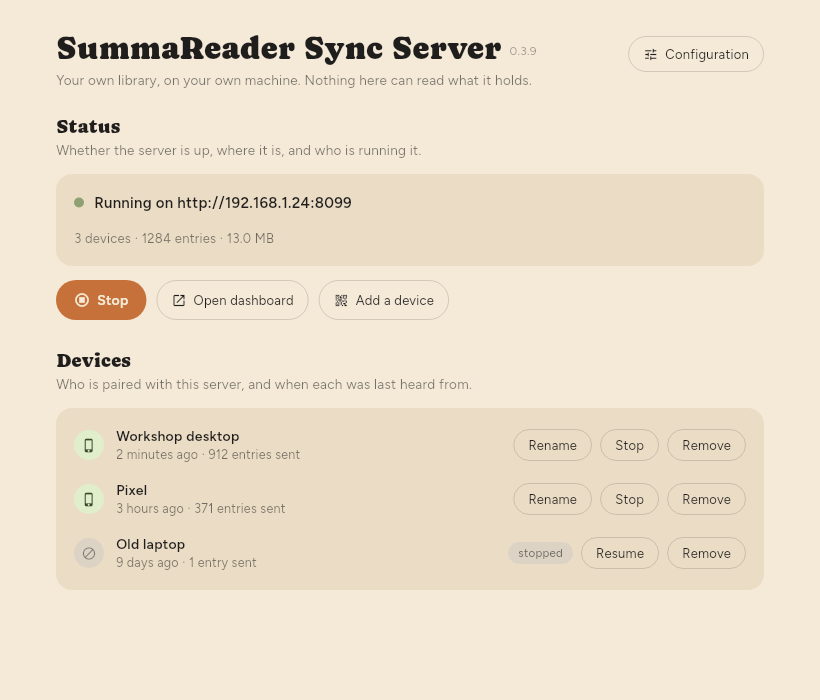

# Running it

Three ways into the same server: the binary in a terminal, a desktop console
that supervises that binary, or a container. All three serve the same
`pb_data`, so the choice is about how you like to start things, not about which
server you end up with.

Building any of them is [BUILD.md](BUILD.md).

- [The first device, and every one after it](#the-first-device-and-every-one-after-it)
- [Command line](#command-line)
- [Configuration](#configuration)
- [The desktop console](#the-desktop-console)
- [Docker](#docker)
- [Leaving it running](#leaving-it-running)
- [Finding it on a local network](#finding-it-on-a-local-network)
- [Administration](#administration)
- [Ceilings, if you are hosting for somebody else](#ceilings-if-you-are-hosting-for-somebody-else)
- [Checking a deployment](#checking-a-deployment)

## The first device, and every one after it

**These are two different operations**, and confusing them is the one way to
end up with a server that answers perfectly and syncs nothing.

**The first device** is created from the server, because until one device has a
token there is nobody to authorise the request:

```sh
./summareader-sync first-device "My library" "Desktop" --dir=./pb_data
```

It prints a token once, and it is not recoverable — the server keeps only
something to compare against. Paste it into SummaReader on that device. Add
`--json` for scripting.

**Every device after the first joins from a device that is already paired**, by
scanning that app's pairing code. That code carries the library's *master key*,
which is what makes the library readable — and the server has never held it,
cannot hold it, and so cannot issue one. What the server issues is the new
device's own *server* token, which the app asks for over the network while you
scan:

```sh
curl -X POST http://127.0.0.1:8099/enroll \
  -H "Authorization: Bearer <existing-token>" \
  -d '{"label":"Phone"}'
```

Separate tokens per device are what make revoking one device possible at all.

Running `first-device` a second time does not add a device. It creates a
second, unrelated library on the same server, with its own account and its own
token, sharing nothing with the first.

## Command line

```sh
./scripts/run.sh                  # builds, then serves ./pb_data in the foreground
```

or, spelled out:

```sh
./summareader-sync serve --http=127.0.0.1:8099 --dir=./pb_data
```

`--http` is the address it binds; `--dir` is where the database lives. Bound to
localhost by default, because this server speaks plain HTTP and holds
everybody's ciphertext — a public interface means device tokens crossing the
network in the clear. `SYNC_ADDR` and `SYNC_DIR` are what `run.sh` reads.

## Configuration

Every option is a flag, an environment variable and a key in one JSON file, and
they win in that order:

**command-line flag → environment variable → config file → default.**

That order is the one people expect, and it is the one that keeps every
existing deployment working: `docker compose` and the systemd unit both pass
environment, so neither has to learn about a file to keep doing what it does.
A server with no config file behaves exactly as it did before there was one.

| flag | environment | key | what it is |
|---|---|---|---|
| `--http` | `SUMMAREADER_HTTP` | `http` | host:port to bind |
| `--dir` | `SUMMAREADER_DIR` | `dir` | where the database lives |
| — | `SUMMAREADER_METRICS_TOKEN` | `metrics_token` | the credential `/metrics` wants; empty means the endpoint is off |
| `--no-announce` | `SUMMAREADER_NO_ANNOUNCE` | `no_announce` | do not advertise on the local network |
| `--config` | `SUMMAREADER_CONFIG` | — | where the file itself is |

The file lives **inside the data directory**, as `summareader-sync.json`, so
one directory is the whole installation: the database and the settings that
decide where it is served, backed up together and moved together.
[`summareader-sync.example.json`](summareader-sync.example.json) is a copy to
start from — every key with a note above it saying what it is for.

Which means `dir` in the file is a little circular: the file is looked for
inside the data directory, so the directory has to be settled *before* the file
is read, from the flag, the environment or the built-in default only. A `dir`
key still works — it is read from the default location and then moves the
database — but `--dir` or `SUMMAREADER_DIR` is what you want unless you know
why you want the other. `--config` names the file outright and skips all of it.

A file that exists and does not parse **stops the server**, with the parse
error and the path. A config somebody wrote and the server quietly ignored is
the bug that takes an afternoon to find; a server that will not start says so
in the first line of the log.

**The console writes this file.** Changing the address or port in the window
writes `http` back, which is the whole reason the file exists — before it,
settings changed in that window were gone as soon as it closed. Only the keys
that changed are written; everything else in the file is kept, including keys
this version has never heard of, so a comment or a newer server's setting
survives a port change. The write is a temporary file and a rename, and a
malformed existing file is refused rather than replaced.

**The metrics token is deliberately not written by the console.** The console
mints one per window for its own status pane and hands it to the server it
starts; persisting that would turn a secret that exists for the life of a
window into a credential on disk outliving the reason for it. An operator who
wants a scraper sets `metrics_token` themselves — and that one the console
reads and uses, and never shows next to the address in the window, where the
address is meant to be copied and the token is not.

## The desktop console

```sh
./scripts/run.sh gui                  # the short way, from a checkout
cd console && flutter run -d linux    # from source
./scripts/build.sh --console          # or built, into console/build/
```

`run.sh gui` is a convenience rather than a subcommand — the console is a
separate program, and the server binary has no `gui` in it any more. It runs
the release build when one exists and falls back to `flutter run` when it does
not; it builds the server first if Go is here, so Start has something to
start; and it passes `SYNC_DIR` so the window opens this checkout's library
rather than the one in `~/.config`.

**`SYNC_ADDR` is passed only if you set it.** A flag beats the config file, so
passing an address every time meant the one chosen in the window was written
to the file, ignored at the next launch, and looked like a console that
forgets what it was told. Left unset, the address comes from the config inside
the data directory — which is the point of keeping one directory per
installation. That last part is the point: a console opening
`~/.config/summareader-sync` while `run.sh` serves `./pb_data` would report an
empty server and be right about the wrong database.

The console is a Flutter desktop app, a separate program from the server rather
than a window inside it — [BUILD.md](BUILD.md) says why, and how it finds the
server binary to run.

`--http` and `--dir` work here too, spelled as the server spells them, and so
does the [config file](#configuration) and the same precedence — without any of
them it opens on `127.0.0.1:8099` and `~/.config/summareader-sync`. If a
service is already installed, it opens on *that* service's address instead,
because that is where the server actually is.



What it shows and what each control does:

| | |
|---|---|
| **status line** | whether the server is up, on which address, and — when a unit is installed — that systemd is the one running it. Also when there is no server binary to be found, which is the one failure that would otherwise look like a button that does nothing |
| **counts** | devices, log entries and what the database weighs |
| **the device list** | every device paired with this server: what it is called, when it was last heard from, and how many entries it has sent. Revoked devices stay on the list and say so — a device someone stopped is one they should still be able to see — and so does a device that has sent nothing, which is either brand new or not getting through |
| **Address** | the bind address and port. Loopback and `0.0.0.0` are offered first because they are the two *decisions*; after them, every address this machine actually answers on, labelled with its interface. Changing either restarts the server, writes the [config file](#configuration), and rewrites the unit when there is one — both, because a unit and a config that disagree are worse than either |
| **Data directory** | where the database is. Set with `--dir` at launch; not editable here |
| **Start at login** | writes `~/.config/systemd/user/summareader-sync.service` and enables it, so the server comes back after a reboot without the console. Unchecking removes it again. Linux only — the row is absent elsewhere |
| **running** | what that unit runs: this binary, or `docker compose`. The container choice appears only when there is a `docker-compose.yml` next to the binary or beside the data directory |
| **Start / Stop** | the server. With a unit installed this drives `systemctl --user`; without one it starts a child process |
| **Open dashboard** | PocketBase's admin interface, which is the real one — see [Administration](#administration) |
| **Create first device** | with an empty server: makes the library and shows its token, as text and as a QR code, with a menu of which address to put in the code |
| **Add a device** | with a library already there: explains that a device joins by scanning a code **in SummaReader**, and hands you the `/enroll` request |

**The console supervises the server as a child process rather than embedding
it.** It runs the same argv the systemd unit runs — one function produces both,
and a test asserts they match — so the console path and the service path cannot
drift into two different servers, and the server's own `log.Fatal` cannot take
the console down with it. The counts come from that process's `/metrics` and
`/overview`, rather than from a second connection to the SQLite file it is
writing.

**One owner at a time.** With a unit installed, systemd owns the server and the
console is a remote control for it: Start and Stop drive `systemctl`, and the
console never starts a child of its own. Two processes writing one SQLite file
is how a sync server corrupts itself, and neither of them would notice. Closing
the console stops a child it started, for the same reason — an unsupervised
child leaves the next Start finding the port taken with nothing to say why —
and never stops a server systemd owns, since being left running is the whole
point of having installed one.

The metrics token, when a unit is installed, is read back out of that unit
rather than minted fresh. A new token against a full server reads as zero
devices, which looks exactly like a server nobody has ever paired with.

The QR code the console draws carries the address and a token —
`{"version":2,"server":…,"device_token":…}` — and deliberately **no key**,
unlike the app's own pairing code. It is what typing those two things by hand
would say, in a form a camera can read.

## Docker

```sh
./scripts/run.sh --docker         # foreground, Ctrl-C — needs no Go toolchain
./scripts/install.sh --docker     # or left running, restarted after a reboot
```

```sh
docker compose up -d
docker compose exec sync summareader-sync first-device "My library" "Desktop" --dir=/data
```

Compose offers the port on `127.0.0.1` and on one named address. `SYNC_BIND` is
the address other devices reach this machine by and `SYNC_PORT` the port both
mappings use; delete the second line for a machine that syncs only with itself.
Anywhere less private than a network you control wants a TLS terminator in
front of it exposed instead.

It serves the database that is already here — `./pb_data`, the same directory
the native path uses, bind-mounted rather than a named volume. A volume would
mean two databases, one empty, and a server that answers correctly while
knowing nothing: every device unenrolled, with no error to say why. Set
`SYNC_UID`/`SYNC_GID` if that directory is not owned by uid 1000, or a bind
mount the container cannot write reports `attempt to write a readonly
database`, which is a permission error wearing a misleading sentence.

`SUMMAREADER_METRICS_TOKEN` is passed through when set, which is how the
console reads the counts out of a container it started. The container reads the
same [config file](#configuration) as everything else — it is in `/data`, which
is `./pb_data` — but the compose file passes `--http` and `--dir` on the command
line, so those two are the image's and not the file's.

Losing `pb_data` does not lose anybody's library — those live on the devices —
but it does lose every device's token and the account they share, so every
device would have to be paired again.

## Leaving it running

```sh
./scripts/install.sh              # builds it, installs a systemd user service
./scripts/install.sh --uninstall  # reversed; the database is kept
```

The console's "Start at login" switch does the same thing, for somebody who
has the binaries and not the repository. Either way it is a *user* service,
under `~/.config/systemd/user`: this holds one person's ciphertext on one
person's machine, and a unit there needs no root to install, inspect or remove.
For a shared box, copy it to `/etc/systemd/system`, give it a `User=` and drop
the `--user` flags.

```sh
systemctl --user status summareader-sync
journalctl --user -u summareader-sync -f
sudo loginctl enable-linger "$USER"    # or it stops when you log out
```

`scripts/summareader-sync.service` is the template the installer script fills
in — edit that rather than the installed copy, which is overwritten on the next
install. The console writes its unit directly and does not read that template;
turning the switch off removes what it wrote.

The Docker path installed by `install.sh --docker` has no unit at all:
`restart: unless-stopped` and an enabled `docker.service` already bring the
container back, and a unit beside compose is a second thing to keep in step.
The console's switch is the exception — there, one checkbox covers both, and
one place to look when it did not come back.

## Finding it on a local network

The server advertises itself over mDNS as `_summareader-sync._tcp`, so a client
on the same network can offer it rather than asking somebody to read an IP
address off a router. `serve --no-announce` turns it off, for networks that
would rather nothing multicast and for hosted instances that have no reason to
shout on whatever network they sit in.

**Two things it does not survive, both worth knowing before relying on it.**

Docker's default bridge network does not carry multicast to the LAN, so a
container started by the compose file here is not discoverable. That needs
`network_mode: host`, which also gives up the port mapping — a deliberate
trade, not an oversight.

And on a host already running a responder of its own, discovery is uneven:
verified working between processes with avahi-daemon running, and
`avahi-browse` on that same host still does not list it. A client on another
machine is the case that matters and is the case least affected, but this is a
convenience that can fail quietly, which is why the address always works and
nothing depends on this.

## Administration

PocketBase's own dashboard is at `/_/`, and it is where backups, restores and
raw inspection live. Create a superuser to reach it:

```sh
./summareader-sync superuser create you@example.com --dir=./pb_data
docker compose exec sync summareader-sync superuser create you@example.com
```

**What an admin interface here can and cannot do is decided by the encryption,
not by effort.** The server holds opaque ciphertext and no keys. So it can:

- list, enrol and revoke devices, and see when each last synced
- back up and restore the whole store
- delete an account's data outright, which is what `/wipe` is
- report how much space an account is using

And it cannot, ever:

- delete a feed, or show you one — it does not know what a feed is
- apply retention by content, age of an article, or read state
- search anything

Those belong in the app, which has the keys. An admin screen offering them
would either be lying or would mean giving the server the keys, which is the
one thing this design exists to avoid.

A backup taken here is safe to keep anywhere, and **useless without the
recovery code** — it is ciphertext. That is a feature, and it is also the thing
to remember before relying on the backup as your only copy.

## Ceilings, if you are hosting for somebody else

Both of these are **off**, and stay off unless you set a number. If you
self-host, the disk is yours and you can already see it — there is nothing here
for you. They exist for the case where somebody else's growth is your bill.

**Storage.** Each account has a `quota_bytes` field, editable in the dashboard.
Zero means no ceiling. Set it and the account is refused an append or a new
blob once its stored payload would exceed it — answered as `507` with a
sentence the app shows the person, not a status code they can do nothing with.

Usage is summed at the check rather than kept in a counter column, so it cannot
drift out of step with wipes and deletions. Payload bytes only: row overhead
and indexes are real disk too, but a ceiling somebody can reason about is worth
more than one that is exactly right.

**Request rate.** PocketBase ships its own rate limiter, disabled by default,
under Settings → Rate limits in the dashboard. Rules match by path prefix, so
`/append` and `/blob` can be limited without any code here. It is per-client,
not per-account, which is the right shape for abuse and the wrong shape for
billing — if you ever need a ceiling per paying account, that is a different
mechanism and this is not it.

**Neither of these prunes anything.** The log is append-only: read state and
highlights append to it forever, so an account grows with use, not with the
size of the library. A quota over a log nothing prunes is a ceiling an active
account eventually reaches whatever it stores, and today the only remedy the
server can offer is a wipe.

## Metrics

`GET /overview` answers the same token with the console's version of the same
question: totals, plus every device with its label, last-seen and how much it
has appended. It exists because `/metrics` is counts-only by design — a
per-device table there would mean Prometheus labels carrying people's device
names — and because `/devices` answers a *device* token and is scoped to that
device's account, which an operator's console does not have. Nothing in it
describes the contents of an entry, for the same reason nothing in `/metrics`
does: the server cannot read one.

`GET /metrics` answers in the Prometheus text format when
`SUMMAREADER_METRICS_TOKEN` — or `metrics_token` in the
[config file](#configuration) — is set, and 404s when it is not. The scraper
sends it as a bearer token.

```sh
SUMMAREADER_METRICS_TOKEN=$(openssl rand -hex 24) ./summareader-sync serve
```

Accounts, devices, log entries, blobs, bytes held — in total and per account,
because "the server is full" is never the useful form of that question. Plus
memory, goroutines and uptime.

**A monitoring system does not get a device token.** One credential that can
both scrape and read the log is a monitoring system that has the library, so
this is its own secret. Everything reported is a count, a byte total or an age:
the server holds ciphertext and cannot read an entry, and a test asserts that
no payload ever appears in the output.

## Checking a deployment

```sh
./scripts/smoke.sh          # build, start, exercise the contract
./scripts/smoke.sh --clean  # and remove the container and its volume
```

Twelve checks: that the image builds and starts, that all five operations
answer, that an unauthenticated request is refused, that a second device can
enrol without a shell, that listed devices do not carry their tokens, and that
the log and the blobs survive a restart. The unit tests cover the handlers;
this covers everything around them that can be broken while every test passes.
